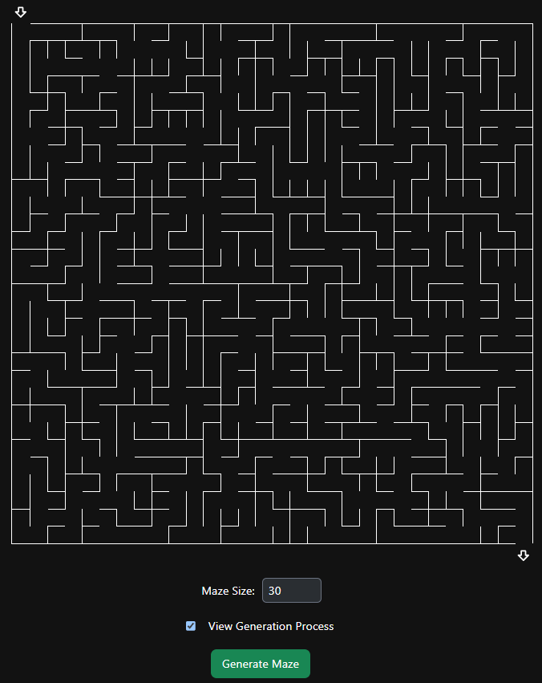

# Maze Generator
This is a maze generator based on **Kruskal's Algorithm**. The algorithm ensures that all cell in the maze is reachable. Every cell is connected to each other with **one and only one** path.

## How to Setup
```bash
npm install
npm run dev # Dev mode

# Compile and run
npm run build
npm run start
```

## How to Play
1. Visit http://localhost:3000
2. Set your Maze Size (5 - 80)
3. Check if you would like to view the maze generation process (Will be slower)
4. Click `Generate Maze`

## Screenshot

